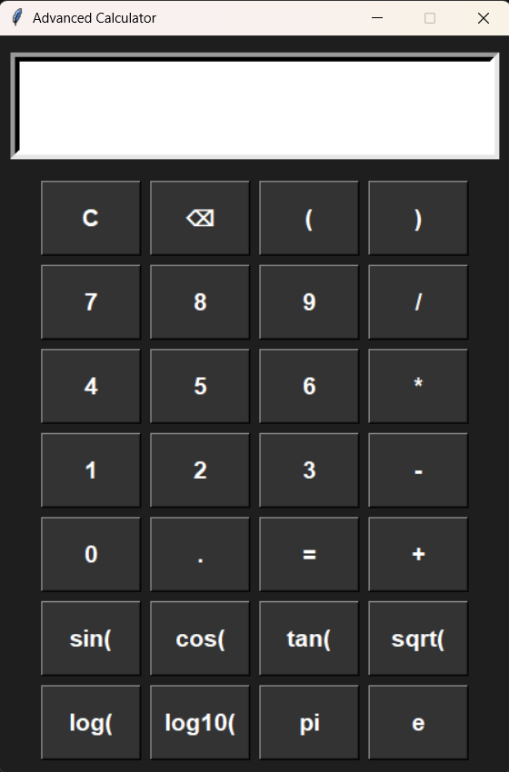

**Advanced Calculator**

A simple Advanced Calculator built using Python and Tkinter. It performs both basic and scientific mathematical calculations through an easy-to-use graphical interface.

**Features**

- Basic arithmetic operations
- Scientific functions ("sin", "cos", "tan", "sqrt", "log", "log10")
- Constants ("pi", "e")
- Clear and Backspace buttons
- Error handling

**Technologies Used**

- Python
- Tkinter
- Math Module

**Run the Project**

python cal.py

**Author**

Deepanshu kaushik

##Screenshot

